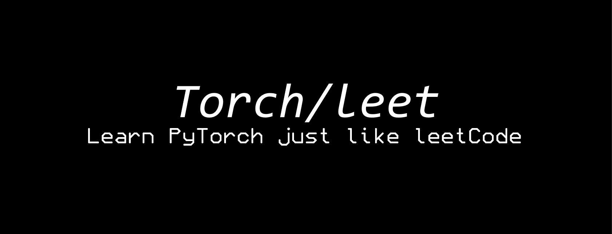

  
  <!-- <h1>TorchLeet</h1> -->
  

    🐦 <a href="https://twitter.com/charoori_ai">Follow me on Twitter</a> •
    📧 <a href="mailto:chandrahas.aroori@gmail.com?subject=LLM%20Cookbook">Feedback</a>
  

  

    
  

 

TorchLeet is a curated set of PyTorch practice problems, inspired by LeetCode-style challenges, designed to enhance your skills in deep learning and PyTorch. **NOW WITH LLMS!**

## Table of Contents
- [TorchLeet](#torchleet)
  - [Table of Contents](#table-of-contents)
  - [Question Set](#question-set)
    - [🟢Easy](#easy)
    - [🟡Medium](#medium)
    - [🔴Hard](#hard)
  - [LLM Set](#llm-set)
  - [Getting Started](#getting-started)
    - [1. Install Dependencies](#1-install-dependencies)
    - [2. Structure](#2-structure)
    - [3. How to Use](#3-how-to-use)
- [Contribution](#contribution)
- [Authors:](#authors)

## Question Set

### 🟢Easy
1. [Implement linear regression](https://github.com/Exorust/TorchLeet/torch/easy/e1/lin-regression.ipynb) [(Solution)](https://github.com/Exorust/TorchLeet/torch/easy/e1/lin-regression_SOLN.ipynb)
2. [Write a custom Dataset and Dataloader to load from a CSV file](https://github.com/Exorust/TorchLeet/torch/easy/e2/custom-dataset.ipynb) [(Solution)](https://github.com/Exorust/TorchLeet/torch/easy/e2/custom-dataset_SOLN.ipynb) 
3. [Write a custom activation function (Simple)](https://github.com/Exorust/TorchLeet/torch/easy/e3/custom-activation.ipynb) [(Solution)](https://github.com/Exorust/TorchLeet/blob/main/e3/custom-activation_SOLN.ipynb)
4. [Implement Custom Loss Function (Huber Loss)](https://github.com/Exorust/TorchLeet/torch/easy/main/e4/custom-loss.ipynb) [(Solution)](https://github.com/Exorust/TorchLeet/torch/easy/main/e4/custom-loss_SOLN.ipynb)  
5. [Implement a Deep Neural Network](https://github.com/Exorust/TorchLeet/torch/easy/e5/custon-DNN.ipynb) [(Solution)](https://github.com/Exorust/TorchLeet/torch/easy/e5/custon-DNN_SOLN.ipynb)  
6. [Visualize Training Progress with TensorBoard in PyTorch](https://github.com/Exorust/TorchLeet/torch/easy/e6/tensorboard.ipynb) [(Solution)](https://github.com/Exorust/TorchLeet/torch/easy/e6/tensorboard_SOLN.ipynb)  
7. [Save and Load Your PyTorch Model](https://github.com/Exorust/TorchLeet/torch/easy/e7/save_model.ipynb) [(Solution)](https://github.com/Exorust/TorchLeet/torch/easy/e7/save_model_SOLN.ipynb) 
10. Implement Softmax function from scratch

### 🟡Medium 
1. [Implement an LSTM](https://github.com/Exorust/TorchLeet/torch/medium/m1/LSTM.ipynb) [(Solution)](https://github.com/Exorust/TorchLeet/torch/medium/m1/LSTM_SOLN.ipynb)  
2. [Implement a CNN on CIFAR-10](https://github.com/Exorust/TorchLeet/torch/medium/m2/CNN.ipynb) [(Solution)](https://github.com/Exorust/TorchLeet/torch/medium/m2/CNN_SOLN.ipynb)  
3. [Implement parameter initialization for a CNN]() [(Solution)]()
4. [Implement an RNN](https://github.com/Exorust/TorchLeet/torch/medium/m3/RNN.ipynb) [(Solution)](https://github.com/Exorust/TorchLeet/torch/medium/m3/RNN_SOLN.ipynb)  
5. [Use `torchvision.transforms` to apply data augmentation](https://github.com/Exorust/TorchLeet/torch/medium/m4/augmentation.ipynb) [(Solution)](https://github.com/Exorust/TorchLeet/torch/medium/m4/augmentation_SOLN.ipynb)  
6. [Add a benchmark to your PyTorch code](https://github.com/Exorust/TorchLeet/torch/medium/m5/bench.ipynb) [(Solution)](https://github.com/Exorust/TorchLeet/torch/medium/m5/bench_SOLN.ipynb)  
7. [Train an autoencoder for anomaly detection](https://github.com/Exorust/TorchLeet/torch/medium/m6/autoencoder.ipynb) [(Solution)](https://github.com/Exorust/TorchLeet/torch/medium/m6/autoencoder_SOLN.ipynb)
8. Implement AlexNet from scratch 
9. Build a Dense Retrieval System using PyTorch

** Finding these too easy? Try implementing from scratch in empty ntbk**

### 🔴Hard
1. [Write a custom Autograd function for activation (SILU)](https://github.com/Exorust/TorchLeet/torch/hard/h1/custom-autgrad-function.ipynb) [(Solution)](https://github.com/Exorust/TorchLeet/torch/hard/h1/custom-autgrad-function_SOLN.ipynb)
2. Write a Neural Style Transfer  
3. [Write a Transformer](https://github.com/Exorust/TorchLeet/torch/hard/h3/transformer.ipynb) [(Solution)](https://github.com/Exorust/TorchLeet/torch/hard/h3/transformer_SOLN.ipynb)  
4. [Write a GAN](https://github.com/Exorust/TorchLeet/torch/hard/h4/GAN.ipynb) [(Solution)](https://github.com/Exorust/TorchLeet/torch/hard/h4/GAN_SOLN.ipynb)  
5. [Write Sequence-to-Sequence with Attention](https://github.com/Exorust/TorchLeet/torch/hard/h5/seq-to-seq-with-Attention.ipynb) [(Solution)](https://github.com/Exorust/TorchLeet/torch/hard/h5/seq-to-seq-with-Attention_SOLN.ipynb)  
6. [Quantize your language model](https://github.com/Exorust/TorchLeet/torch/hard/h6/quantize-language-model.ipynb) [(Solution)](https://github.com/Exorust/TorchLeet/torch/hard/h6/quantize-language-model_SOLN.ipynb)
7. [Enable distributed training in pytorch (DistributedDataParallel)]
8. [Work with Sparse Tensors]
9. [Implement Mixed Precision Training using torch.cuda.amp](https://github.com/Exorust/TorchLeet/torch/hard/h9/cuda-amp.ipynb) [(Solution)](https://github.com/Exorust/TorchLeet/torch/hard/h9/cuda-amp_SOLN.ipynb)
10. [Add GradCam/SHAP to explain the model.](https://github.com/Exorust/TorchLeet/torch/hard/h10/xai.ipynb) [(Solution)](https://github.com/Exorust/TorchLeet/torch/hard/h10/xai_SOLN.ipynb)

## LLM Set

**An all new set of questions to help you understand and implement Large Language Models from scratch.**

1. Implement KL Divergence Loss
2. Implement RMS ~~Norm~~
3. [Implement Byte Pair Encoding from Scratch](https://github.com/Exorust/TorchLeet/torch/llm/Byte-Pair-Encoding/BPE-q3-Question.ipynb) [(Solution)](https://github.com/Exorust/TorchLeet/torch/llm/Byte-Pair-Encoding/BPE-q3.ipynb)
4. [Create an embeddings out of an LLM](https://github.com/Exorust/TorchLeet/torch/llm/Create-Embeddings-out-of-an-LLM/embeddings-q2-Question.ipynb)[(Solution)](https://github.com/Exorust/TorchLeet/torch/llm/Create-Embeddings-out-of-an-LLM/embeddings-q2.ipynb)
5. Implement Predictive Prefill with Speculative Decoding
6. [Implement Attention from Scratch ](https://github.com/Exorust/TorchLeet/torch/llm/Implement-Attention-from-Scratch/attention-q4-Question.ipynb)[(Solution)](https://github.com/Exorust/TorchLeet/torch/llm/Implement-Attention-from-Scratch/attention-q4.ipynb)
7. [Implement Multi-Head Attention from Scratch](https://github.com/Exorust/TorchLeet/torch/llm/Multi-Head-Attention/multi-head-attention-q5-Question.ipynb)[(Solution)](https://github.com/Exorust/TorchLeet/torch/llm/Multi-Head-Attention/multi-head-attention-q5.ipynb)
8. [Implement Grouped Query Attention from Scratch](https://github.com/Exorust/TorchLeet/torch/llm/Grouped-Query-Attention/grouped-query-attention-Question.ipynb)[(Solution)](https://github.com/Exorust/TorchLeet/torch/llm/Grouped-Query-Attention/grouped-query-attention.ipynb)
9. Implement KV Cache in Multi-Head Attention from Scratch
10. [Implement Sinusoidal Embeddings](https://github.com/Exorust/TorchLeet/torch/llm/Sinusoidal-Positional-Embedding/sinusoidal-q7-Question.ipynb)[(Solution)](https://github.com/Exorust/TorchLeet/torch/llm/Sinusoidal-Positional-Embedding/sinusoidal-q7.ipynb)
11. [Implement ROPE Embeddings](https://github.com/Exorust/TorchLeet/torch/llm/Rotary-Positional-Embedding/rope-q8-Question.ipynb)[(Solution)](https://github.com/Exorust/TorchLeet/torch/llm/Rotary-Positional-Embedding/rope-q8.ipynb)
12. [Implement SmolLM from Scratch](https://github.com/Exorust/TorchLeet/torch/llm/SmolLM/smollm-q12-Question.ipynb)[(Solution)](https://github.com/Exorust/TorchLeet/torch/llm/SmolLM/smollm-q12.ipynb)
13. Implement Quantization of Models
    a. Types of Quantization
14. Implement Beam Search atop LLM for decoding
15. Implement Top K Sampling atop LLM for decoding
16. Implement Top p Sampling atop LLM for decoding
17. Implement Temperature Sampling atop LLM for decoding
18. Implement LoRA on a layer of an LLM
19. Mix two models to create a mixture of Experts
20. Apply SFT on SmolLM 
21. Apply RLHF on SmolLM
22. Implement DPO based RLHF
23. Add continous batching to your LLM
24. Chunk Textual Data for Dense Passage Retreival
25. Implement Lage scale Training => 5D Parallelism

**What's cool? 🚀**
- **Diverse Questions**: Covers beginner to advanced PyTorch concepts (e.g., tensors, autograd, CNNs, GANs, and more).
- **Guided Learning**: Includes incomplete code blocks (`...` and `#TODO`) for hands-on practice along with Answers

## Getting Started

### 1. Install Dependencies
- Install pytorch: [Install pytorch locally](https://pytorch.org/get-started/locally/)
- Some problems need other packages. Install as needed.

### 2. Structure
- `<E/M/H><ID>/`: Easy/Medium/Hard along with the question ID.
- `<E/M/H><ID>/qname.ipynb`: The question file with incomplete code blocks.
- `<E/M/H><ID>/qname_SOLN.ipynb`: The corresponding solution file.

### 3. How to Use
- Navigate to questions/ and pick a problem
- Fill in the missing code blocks `(...)` and address the `#TODO` comments.
- Test your solution and compare it with the corresponding file in `solutions/`.

**Happy Learning! 🚀**

# Contribution
Feel free to contribute by adding new questions or improving existing ones. Ensure that new problems are well-documented and follow the project structure. Submit a PR and tag the authors.

# Authors

  <table>
    <tr>
      <td align="center">
        <a href="https://github.com/Exorust">
          
           
          <b>Chandrahas Aroori</b>
        </a>
         
        💻 AI/ML Dev
         
         
        
        
      </td>
      <td align="center">
        <a href="https://github.com/CaslowChien">
          
           
          <b>Caslow Chien</b>
        </a>
         
        💻 Developer
         
         
        
        
      </td>
    </tr>
  </table>

                        
## Stargazers over time

